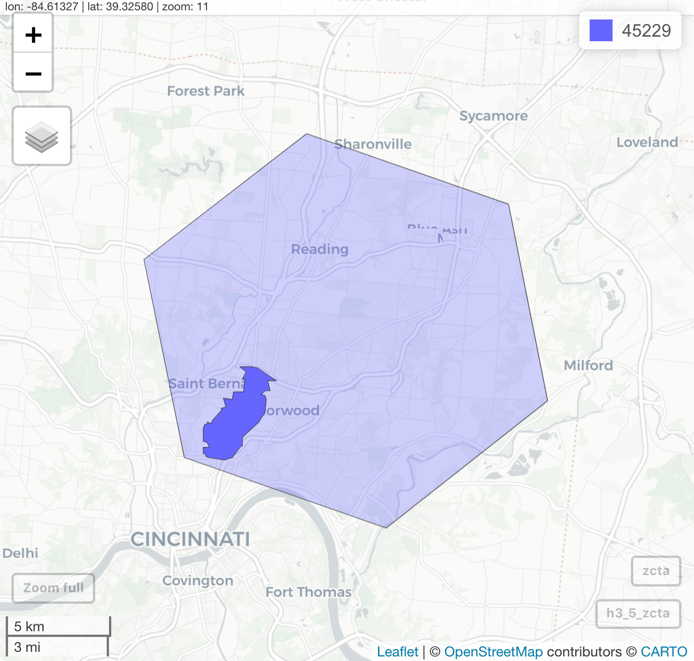
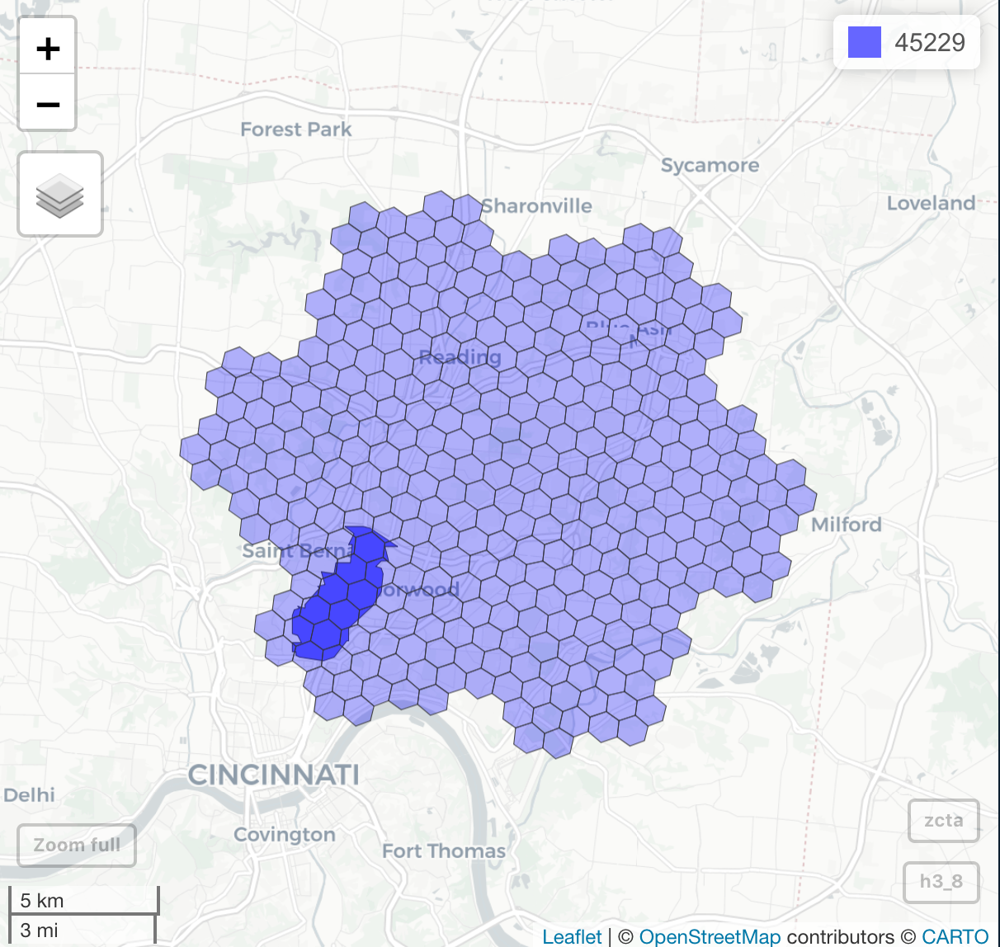
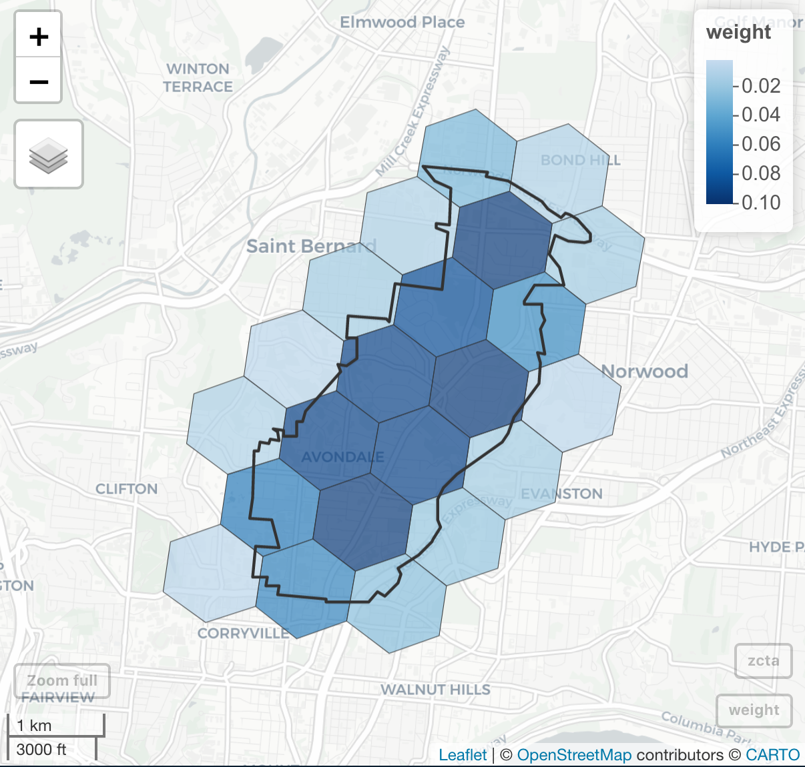

# zcta_to_h3

> map ZCTAs to all overlapping resolution 8 h3 cells

<!-- badges: start -->
<!-- badges: end -->

## Using the ZCTA to h3 Crosswalk

[ZCTA to h3 crosswalk PM2.5 example](https://geomarker.io/zcta_to_h3)

## Creating the ZCTA to h3 Crosswalk

1. Get overlapping resolution 5 h3 cell(s)

2. Expand resolution 5 cell(s) to resolution 8

3. Get overlapping resolution 8 h3 cells

    - if zcta is outside all resolution 8 cells, use `k_ring()` to get all neighboring resolution 5 cells and repeat steps 2 and 3

4. Calculate weights (area of intersection of h3 cell and zcta / area of zcta)

    - if sum of weights is less than 0.99, use `k_ring()` to get all neighboring resolution 5 cells and repeat steps 2, 3, and 4
    

    

